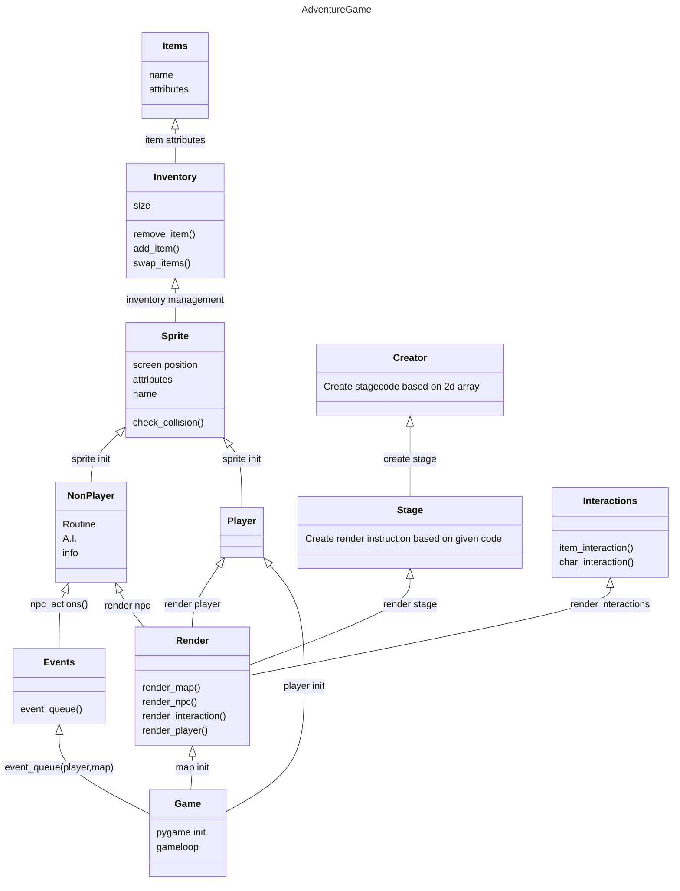

```mermaid
---
title: AdventureGame
---
classDiagram
    
    Events <|-- Game  : event_queue(player,map)
    Render <|-- Game : map init
    NonPlayer <|-- Events : npc_actions()
    Sprite <|-- NonPlayer : sprite init
    Sprite <|-- Player : sprite init
    Stage <|-- Render : render stage
    Creator <|-- Stage : create stage
    Player <|-- Render : render player
    NonPlayer <|-- Render : render npc
    Interactions <|-- Render :render interactions
    Inventory <|-- Sprite : inventory management
    Items <|-- Inventory : item attributes
    Player <|-- Game : player init
    
    class Game{
        pygame init
        gameloop
    }
    class Render{
        render_map()
        render_npc()
        render_interaction()
        render_player()
    }
    class Events{
        event_queue()
        
    }
    class Interactions{
        item_interaction()
        char_interaction()
        
    }
    class Sprite{
        screen position
        attributes
        name
        check_collision()
    }
    class Items{
        name
        attributes
    }
    class Inventory{
        size
        remove_item()
        add_item()
        swap_items()
        
    }
    class NonPlayer{
        Routine
        A.I.
        info
    }
    class Creator{
        Create stagecode based on 2d array
    }
    class Stage{
        Create render instruction based on given code
    }
```