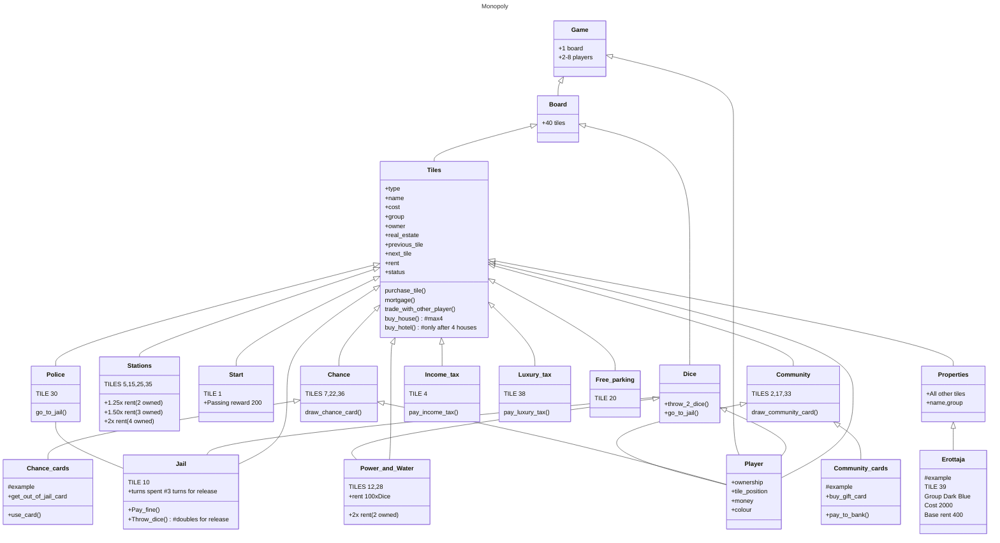

```mermaid
---
title: Monopoly
---
classDiagram
    
    Board <|-- Tiles
    Tiles <|-- Player
    Dice <|-- Player
    Board <|-- Dice
    Game <|-- Board
    Game <|-- Player
    Tiles <|-- Stations
    Tiles <|-- Power_and_Water
    Dice <|-- Power_and_Water
    Tiles <|-- Start
    Tiles <|-- Jail
    Tiles <|-- Police
    Dice -- Jail
    Police -- Jail
    Tiles <|-- Chance
    Tiles <|-- Community
    Tiles <|-- Income_tax
    Tiles <|-- Luxury_tax
    Tiles <|-- Free_parking
    Tiles <|-- Properties
    Chance <|-- Player
    Community <|-- Player
    Chance <|-- Chance_cards
    Community <|-- Community_cards
    Properties <|-- Erottaja
    
    class Game{
        +1 board
        +2-8 players
    }

    class Board{
        +40 tiles
        
    }
    class Tiles{
        +type
        +name
        +cost
        +group
        +owner
        +real_estate
        +previous_tile
        +next_tile
        +rent
        +status
        purchase_tile()
        mortgage()
        trade_with_other_player()
        buy_house() #max4
        buy_hotel() #only after 4 houses
    }
    class Dice{
        +throw_2_dice()
        +go_to_jail()
    }
    class Player{
        +ownership
        +tile_position
        +money
        +colour
    }
    class Stations{
        TILES 5,15,25,35
        +1.25x rent (2 owned)
        +1.50x rent (3 owned)
        +2x rent (4 owned)
        
    }
    class Power_and_Water{
        TILES 12,28
        +2x rent (2 owned)
        +rent 100xDice
        
        
    }
    class Start{
        TILE 1 
        +Passing reward 200

           }     
    class Jail{
        TILE 10
        +Pay_fine()
        +Throw_dice() #doubles for release
        +turns spent #3 turns for release

           }
    class Police{
        TILE 30
        go_to_jail()

           }
    class Chance{
        TILES 7,22,36
        draw_chance_card()
    }
    class Community{
        TILES 2,17,33
        draw_community_card()}
    class Free_parking{
        TILE 20
        }
    class Income_tax{
        TILE 4
        pay_income_tax()
        }
    class Luxury_tax{
        TILE 38
        pay_luxury_tax()
        }
    class Properties{
        +All other tiles
        +name,group
    }
    class Chance_cards{
        #example
        +get_out_of_jail_card
        +use_card()}
    class Community_cards{
        #example
        +buy_gift_card
        +pay_to_bank()}
    class Erottaja{
        #example
        TILE 39
        Group Dark Blue
        Cost 2000
        Base rent 400
    }
    
```